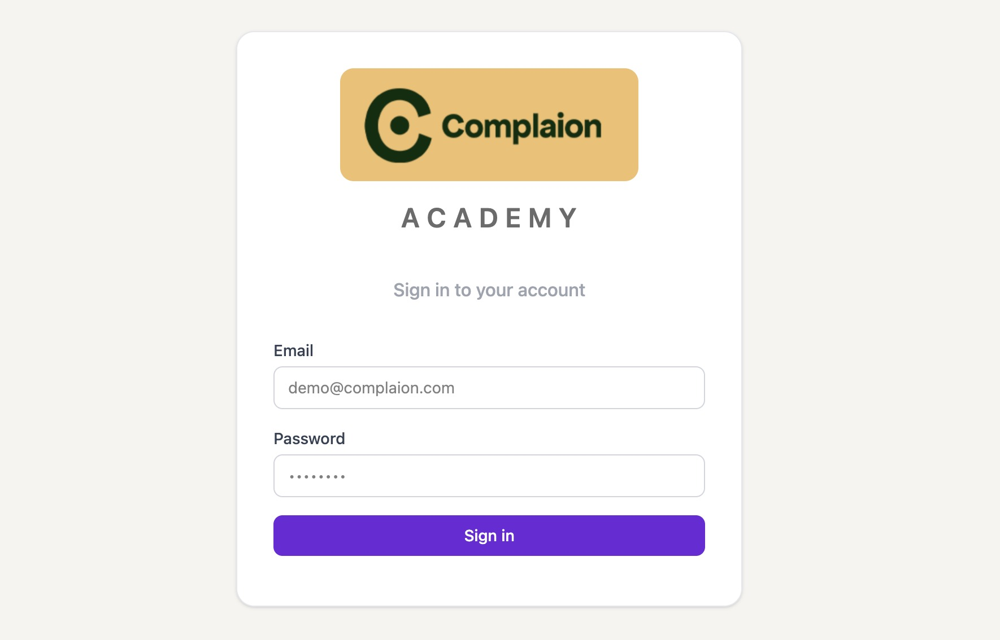
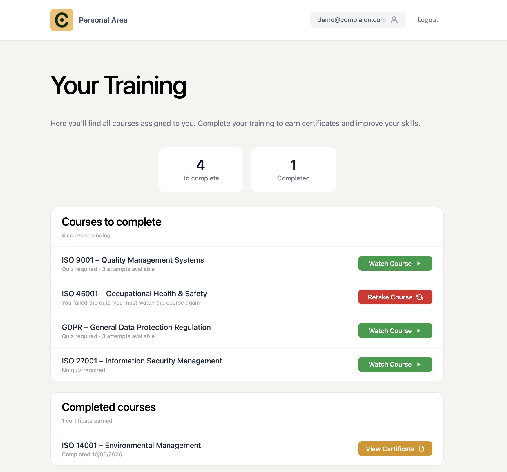
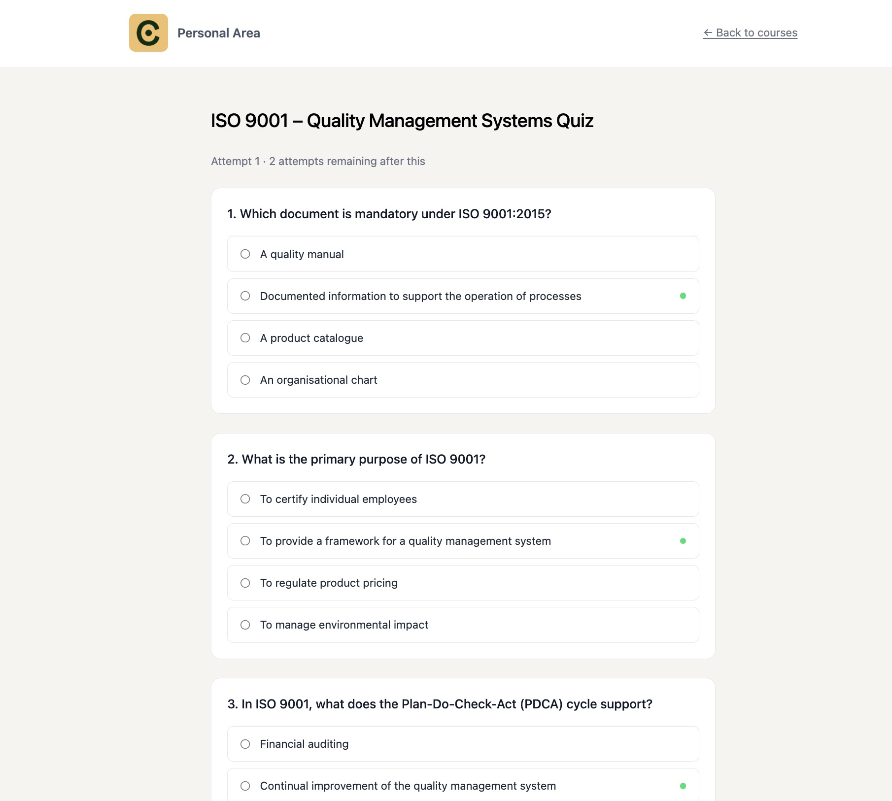
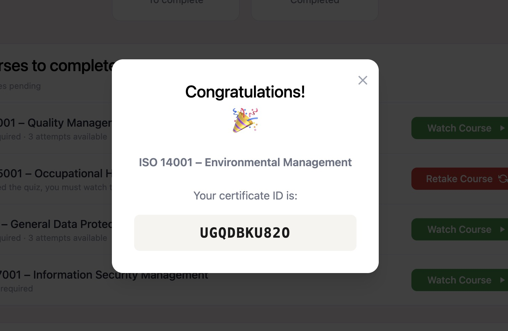

# Complaion Academy Demo

A compliance training platform where employees are assigned courses, watch a video, optionally sit a timed quiz, and receive a certificate on completion. Built as a backend engineering demo.

**Demo credentials**: `demo@complaion.com` / `demo1234`

**Quiz solutions**: green dots provided on the correct answer for quick testing  

---

## Screenshots

<table>
  <tr>
    <td></td>
    <td></td>
  </tr>
  <tr>
    <td></td>
    <td></td>
  </tr>
</table>

---

## Architecture

```
Frontend (React 18 / Vite / TypeScript / Tailwind)
        served by nginx  ·  port 3000
                │
                │ REST + JWT
                ▼
Backend (FastAPI + Motor async driver)
        served by uvicorn  ·  port 8000
                │
                ▼
        MongoDB  ·  port 27017
        seeded automatically on first start
```

- **Auth**: HS256 JWT. The token carries `employee_id`, `company_id`, and `email` — the frontend can display the logged-in user without an extra round-trip.
- **Routing**: The JWT token already contains everything the backend needs (`employee_id`, `company_id`, `email`), so no extra database call is made to identify the caller.
- **Seed**: `mongo-init/seed.js` drops and rebuilds all collections on every container start, guaranteeing a clean demo state after every deploy.

---

## Data Model

| Collection | Purpose |
|---|---|
| `employees` | Login credentials and company membership |
| `interactive_courses` | Course catalogue — name, document IDs, `quiz_required` flag |
| `assigned_interactive_courses` | Per-employee assignment; owns the full lifecycle state machine |
| `quizzes` | Question pool per course — `questions_per_attempt`, `passing_score`, `max_attempts` |
| `quiz_attempts` | One document per attempt; stores the randomly-drawn questions and submitted answers |

---

## Assignment State Machine

| From | Trigger | To |
|---|---|---|
| `todo` | Watch video — no quiz | `done` |
| `todo` | Watch video — quiz required | `pending` |
| `pending` | Pass quiz | `done` |
| `pending` | Fail quiz — attempts remaining | `pending` *(quiz resets to* `not_started`*)* |
| `pending` | Fail quiz — no attempts left | `pending` *(quiz becomes* `exhausted`*)* |
| `exhausted` | Retake course | `todo` *(all fields reset)* |

Quiz status is a sub-state field on the assignment document: `not_started → in_progress → passed | exhausted | not_started`.

The demo is seeded with all five states pre-populated so every flow can be demonstrated without going through the full journey live:

| Course | State |
|---|---|
| ISO 9001 – Quality Management Systems | Fresh (Watch Course) |
| ISO 45001 – Occupational Health & Safety | Quiz exhausted (Retake Course) |
| GDPR – General Data Protection Regulation | Fresh (Watch Course) |
| ISO 14001 – Environmental Management | Completed — no quiz (View Certificate) |
| ISO 27001 – Information Security Management | Fresh (Watch Course) |

---

## Key Design Decisions

- **Email in JWT payload** — avoids a `/me` lookup endpoint just to render the user's email in the header.
- **Questions drawn from a pool** — each attempt randomly selects `questions_per_attempt` from the full pool, so retaking the quiz produces a different question set.
- **Certificate ID derived on the frontend** — a deterministic hash of the `assignment_id`. Stable and unique per assignment with no extra database write.
- **Idempotent seed script** — `db.collection.drop()` before every insert means the script can be re-run safely on every deployment, keeping demo data predictable.

---

## Limitations and Assumptions

- **Demo data only** — MongoDB is seeded at container start with synthetic data. Nothing persists across restarts and the dataset does not reflect a real production environment.
- **Single video per course** — the model supports multiple documents per course, but the demo assumes one video. In production, each course would expose a document menu allowing employees to re-watch individual items before attempting the quiz.
- **Certificate as ID, not PDF** — the certificate page displays a unique deterministic ID derived from the assignment. A production implementation would generate and serve a signed PDF.
- **Single language** — all UI copy and course content is in English. Localisation is not implemented.
- **JWT-only authentication** — access is secured with HS256 JWT issued by the backend. No SSO, OAuth2, or third-party identity provider is integrated.
- **Quiz resumability exposes questions** — when an attempt is started (`IN_PROGRESS`), navigating away and returning re-serves the same question set without creating a new attempt. A stricter implementation would invalidate the open attempt on navigation or enforce a submission time window, preventing candidates from noting questions across sessions.
- **No automated tests** — the service layer (`quiz/service.py`, auth) is structured for unit testing (pure functions, injected dependencies) but tests are not included.


---

## Deployment Option A — Docker Compose (recommended)

Runs everything (MongoDB + backend + frontend) in one command. MongoDB is seeded automatically on first start.

```bash
cp .env.example .env
docker compose up --build
```

| Service  | URL                        |
|----------|----------------------------|
| Frontend | http://localhost:3000      |
| Backend  | http://localhost:8000      |
| API docs | http://localhost:8000/docs |

To stop: `docker compose down`  
To reset the database: `docker compose down -v && docker compose up --build`

---

## Deployment Option B — Run locally (without Docker)

Requires: Python 3.12+, Node.js 22+, a running MongoDB instance.

### 1. MongoDB

Start a local MongoDB on the default port (27017), then seed it:

```bash
mongosh mongodb://localhost:27017 mongo-init/seed.js
```

### 2. Backend

```bash
cd backend
python -m venv .venv
source .venv/bin/activate       # Windows: .venv\Scripts\activate
pip install -r requirements.txt
cp .env.example .env            # edit ACADEMY_JWT_SECRET if needed
uvicorn app.main:app --reload
```

Backend runs at http://localhost:8000 — interactive docs at http://localhost:8000/docs.

### 3. Frontend

```bash
cd frontend
npm install
npm run dev
```

Frontend runs at http://localhost:5173.

> **Note:** when running locally the backend must be started from the `backend/` directory so the `app` package is on the Python path.
